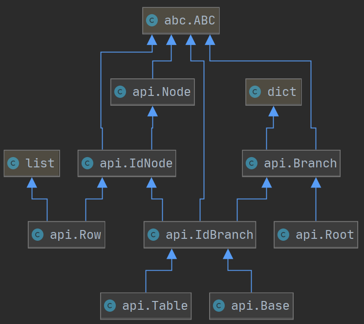
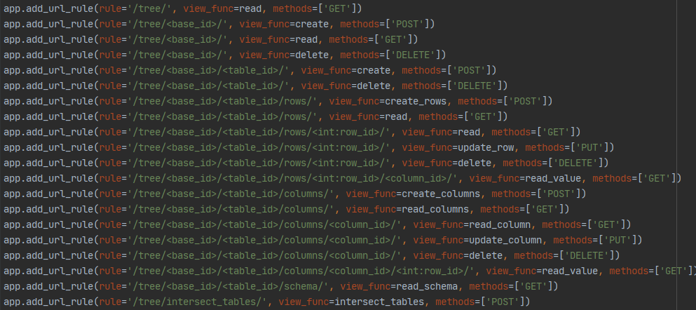

# DBMS
## Features
* Tree-based structure

    
* Switchable MongoDB support

## Connectors:
* Flask REST
* gRPC
* ~~Graphene GraphQL~~ (a bit outdated)

## Demo
### Rest
You can query the deployed REST service:
1) Open https://protected-island-68179.herokuapp.com/
2) Execute in the console
```js
await (await fetch('https://protected-island-68179.herokuapp.com/tree/<RESOURSE>', {method: '<TYPE>'})).json()
```
Examples of using api are present in `tests.test_api.TestRest`

Also, take a look at the endpoints:


### gRPC (locally)
1) Run server.py
2) Using python console:
    ```python
    from grpc_.client import *
    ```
3) Now you can call the grpc_.client module's functions

## [Report (🇺🇦)](Report&#32;(ukr).pdf)